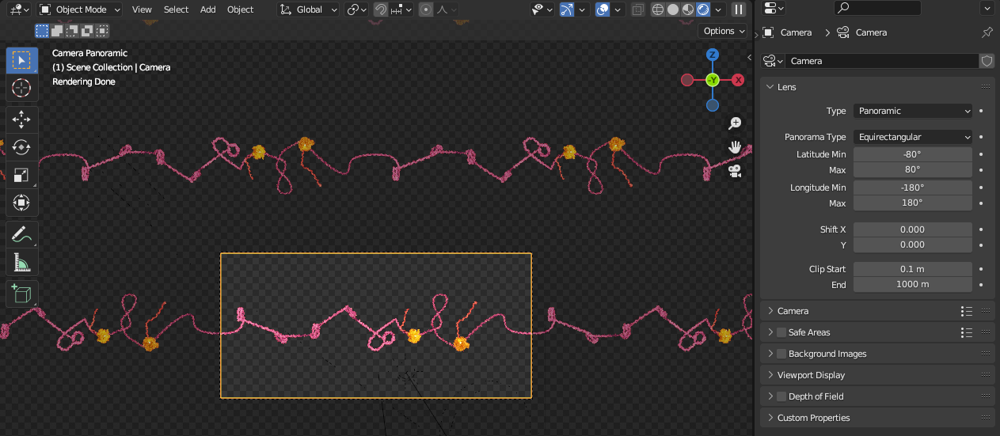

---

title: "Rendering seamless 3D panoramas"
subtitle: "Blender's powerful alternative camera modes"
summary: "Exploring Blender's panoramic camera modes to make a seamless circular render."
authors: []
tags: []
category: Design
date: 2022-12-20
featured: false
draft: false
---

A tradition in the Galloway lab is to celebrate paper publication by creating a mug.
For the recent [supercoiling modeling paper](/publication/supercoiling-mediated-feedback-model/),
I needed to design something. Mugs are circular and I already had a nice Blender file
created for the cover design, could I just wrap chromatin around a (virtual) mug?



After some work, the answer is yes! We have a virtual mug surrounded by a continuous loop of chromatin.
How do we actual render this into a seamless image?

## Blender cameras to the rescue
The default Blender camera is typically either a _perspective_ camera, where
parallel lines converge in the distance, or an _orthographic_ camera, where parallel
lines remain parallel.

Could we use one of these cameras to render our seamless mug? If we imagined setting a camera on the
outside, we could imagine rotating the camera around the centerpoint of the mug, and capture a very thin
vertical frame. We could then combine all of these thin vertical slices into a single panorama. This is
how we would do it if we were trying to capture such a panorama with our phones.



However, Blender lets us actually _directly_ render [panoramic cameras](https://docs.blender.org/manual/en/latest/render/cycles/object_settings/cameras.html),
as long as we are using the raytracing engine, Cycles.

After placing a camera in the center, for the purpose of getting a seamless wrapped image,
we can use the equirectangular mode. By using the rendered viewport mode, we can see how the image changes as
we tweak settings:

After some compositing, we can easily get a nice, seamless rendering that wraps nicely onto an actual physical mug!

[](featured.png)