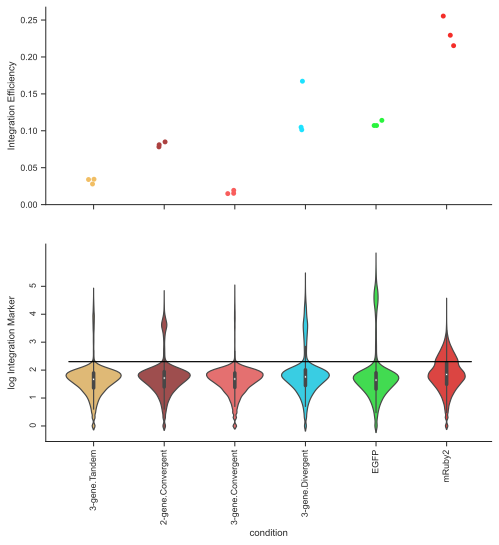
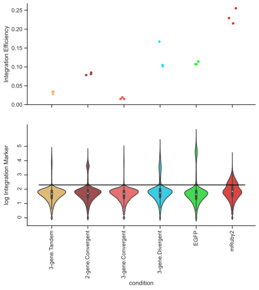
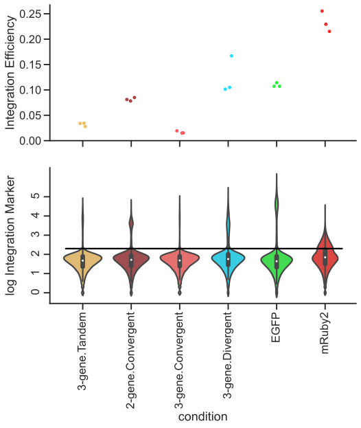
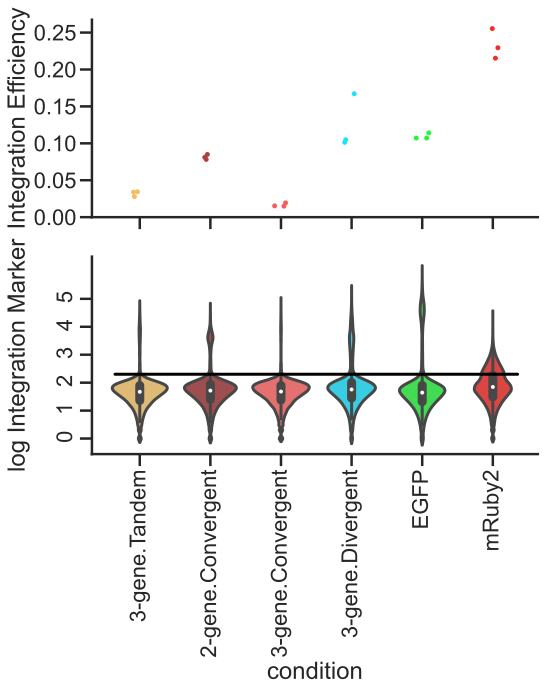



## Seaborn contexts

When playing around with Seaborn-generated graphs within a Jupyter notebook, the default settings output graphs
that are appropriate for viewing in a notebook. However, you can use different [contexts](https://seaborn.pydata.org/generated/seaborn.set_context.html)
to control the output scaling of the graph,
including both the text size, marker size, and default line-widths.

The relevant contexts are:
- ```python
  sns.set_context("paper")
  ```
  Uses display sizes that are appropriate when added to a fixed-page document.
  When using this scaling, output works best if you properly set the width/height
  of the figure to the actual desired print scale (with `plt.figure(width=3, height=5)`
  for example for a 3 inch by 5 inch figure).
  
- ```python
  sns.set_context("notebook")
  ```
  Uses display sizes appropriate for interactive viewing of your figures while testing.
  This gives good results for viewing directly within the notebook.
  
- ```python
  sns.set_context("talk")
  ```
  Uses display sizes that are appropriatly large for placing on presentation
  slides.
  
- ```python
  sns.set_context("poster")
  ```
  Uses display sizes that are readable at a distance when printed
  on a poster.
  

## Matplotlib: aligning subplot labels

When dealing with a plot with multiple subpanels, the x and y labels may not be necessarily
aligned. Instead of manually aligning, you can use [figure.align_xlabels](https://matplotlib.org/stable/api/figure_api.html#matplotlib.figure.Figure.align_xlabels)
and [figure.align_ylabels](https://matplotlib.org/stable/api/figure_api.html#matplotlib.figure.Figure.align_ylabels)
to [align a specific set of axes](https://matplotlib.org/stable/gallery/subplots_axes_and_figures/align_labels_demo.html).
