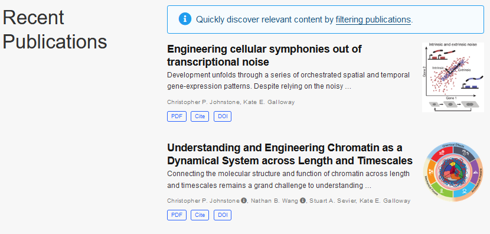

---

title: "Zippy Site from Scratch"
subtitle: ""
summary: "Building a new website that loads with less than 110kB and in under 300ms."
authors: []
tags: []
category: Web Development
date: 2022-11-24
featured: false
draft: false
---
In the dark ages of mid-2020, a recommended repository came across my Github feed.
What was this [Academic template](https://github.com/wowchemy/starter-hugo-academic)?
I had bumped into static-site generators previously, but hadn't seen a template that
caught my fancy. As a recently-started PhD student though, sitting down and finally
creating a site would be helpful.

The template was a [Hugo](https://gohugo.io) template, a Go-powered templating engine
that (mostly) deals with rendering Markdown content files. The Academic template ended
up being super easy to use (props to Geo Cushen, the creator!), and made attractive
website design easy, such as in the publication view:

## In pursuit of single-domain best practices
Coming back a few months later to the website, I realized (after installing
[LocalCDN](https://www.localcdn.org/), an extension that redirects remote
calls to content delivery networks), that my website, like many others out there,
made a bunch of requests to other external sites, in order to load scripts, fonts,
and CSS to make the web page work.

Why were these loading from remote websites? With the advent of shared resources like
Bootstrap, Google Fonts, and others, the idea was that multiple sites should share
this cache. If your site used a font or helper library that some other site had
already loaded from the cache, you could use it "for free" without requiring an
extra download!

This came crashing down when advertisers and others realized you could use this
for tracking. If you _timed_ the time it took to load resources, you could
see which resources loaded instantly vs those that needed to hit the network
and use this to calculate a tracking fingerprint. Sad. Browsers responded
by enforcing cache partitioning, with [Safari](https://bugs.webkit.org/show_bug.cgi?id=110269)
starting around 2013 and other browsers following.

Loading resources from other websites _also_ means that your users are telling
those websites that they visited your website. To fix this, I decided to vendor
all of my dependencies, effectively making sure that I was serving all fonts,
CSS, and JavaScript from my domain. Problem solved, right?

## Further room to shrink the site
While I may have plugged the last privacy hole, I realized that
I was still loading a lot of information to deliver admittedly simple
content. Each load of my homepage was transferring almost 800kB of data
and making many requests. Even on a fast connection, rendering only finished
after _832 ms_:

The final page has nearly 500kB of vendored javascript (the `main.min.js` line)!

I felt like I could do better, while retaining the attractive parts of the website.
I started off by looking at other tech blogs for inspiration.
[Julia Evans](https://jvns.ca/)'s blog caught my eye, so when I had the chance
(read: going stir-crazy in my apartment), I whipped open the Hugo documentation
and found a [tutorial](https://retrolog.io/blog/creating-a-hugo-theme-from-scratch/)
on making your own template.

## Key size and loading speed considerations

Two days later, I was done!
Conveniently, my new template allowed me to use all of my Markdown I had already written for my website.
I could really dig into making sure I had minimal loading sizes and loading times.
At a top-level, I found it helpful to do the following:

- Use a tool like [icomoon](https://icomoon.io) to generate an icon-font including _only_
  the icons you plan on using. Icon sets like Font Awesome are great, but they are also large.
- Make sure that all of your `` tags specify an explicit width and height. This way, your
  browser can fully layout the page before the image finishes downloading.
- Exploit modern HTML5 and CSS practices for the "interactivity" you need on a static site.
  My entire site loads without Javascript (except the Plausible script).

How did I do on page size and load speed?

The page now transfers just **75 kB** and loads
in **282ms**. I'll take a 10x decrease in page size and a 4x decrease in page render time!
As a note, the largest transfer at 34kB is actually now the favicon which does not block
page loading.

_Note: after writing this, I updated how the main page publications loaded, so we are now
up to 110kB due to an extra image_

Finally, while Lighthouse (Google's page-load benchmarker) scores are probably a metric you
shouldn't be explicitly optimizing for, it was nice to see 100% Lighthouse scores from my template!

## Moving forward

I'm happy with the new layout of my website. It makes tracking publications and blog
posts much easier. Will this translate into more blogging or more frequent updates?
Only time will tell.